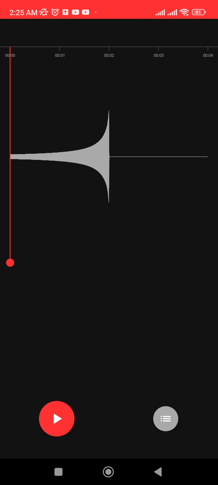
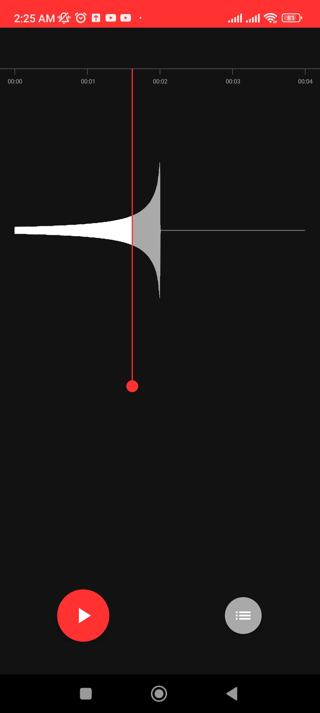
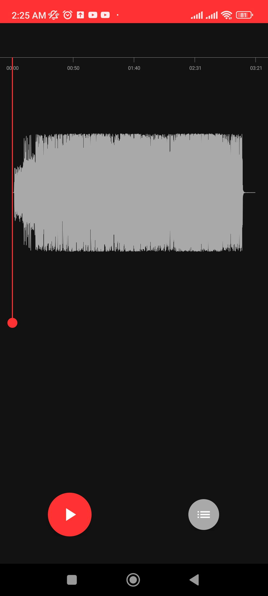
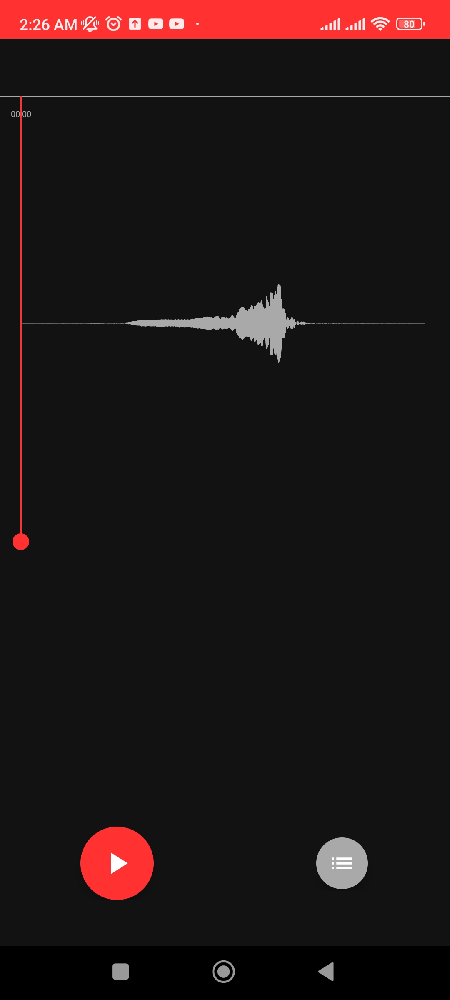
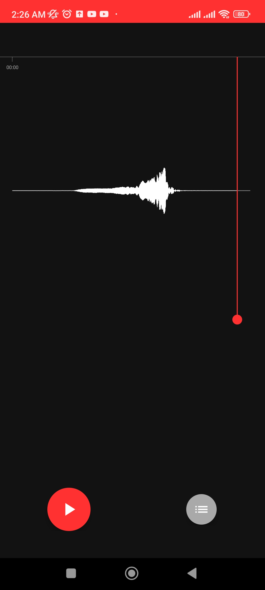

# Waveform Viewer
An app that visualizes the waveform of a loaded audio file and provides interactive navigation within it. This project is an implementation of the ParadoxCat Android challenge.

It is optimized to efficiently handle high-density audio data, such as gravitational wave sound files, which often contain massive amounts of data per second (e.g., 44.1kHz, 16-bit WAV files). Without proper optimizations, visualizing such data in real time would be impractical.

## Challenge Improvements

Since this challenge is open-ended and there are many areas for improvement, I decided to focus on optimizing the waveform rendering, as I believe it is the most important aspect of the application. After all, what's the point of having a visually appealing UI and well-structured code if the main functionality doesn't work properly?

However, I also understand that a bad UI/UX and messy code are not desirable either. Therefore, I also worked on improving the UI/UX of the app and refactoring the code structure.

Here are the main areas that I focused on during this challenge:

### Optimizing Waveform Rendering

The waveform rendering proved to be the most challenging part for me. I tried several solutions before settling on the current one. For example, I experimented with different approaches to downsample the data, setting a fixed distance between samples, and adding the ability to horizontally scroll the waveform. I even tried drawing the lines asynchronously in a sequential manner.

However, most of these solutions proved to be tricky and time-consuming. After studying popular applications like REAPER and Audacity, I realized that there must be a way to draw all the samples without causing the app to hang. Through experimentation and debugging, I discovered the sheer number of samples that could be present in an audio file. It became clear that it is impossible to represent all the samples on the screen due to the limited number of horizontal pixels (columns) available.

For example, on a Full HD display with dimensions of 920x1080 pixels, if we have a 1-second audio file with a sample rate of 44100Hz, there would not be enough horizontal pixels to accurately represent the distance between the samples. After calculating the sample distance for a 3-minute audio file on a Full HD display, we get a value of 0.000115. This means that every column of pixels will contain approximately 8628 samples. Drawing lines between each of these samples will result in them appearing as vertical lines on the screen, providing no benefit in terms of visualization.

To address this issue, I modified the rendering logic. Instead of drawing a line between each pair of adjacent samples, I now draw a single line between the minimum and maximum amplitudes of the samples belonging to the same column of pixels. Additionally, I draw a line between the last value of the current column and the first value of the next column to ensure the lines appear connected on the screen. By implementing this optimization, I was able to skip thousands of unnecessary operations per pixel.

#### Time Complexity:

The time complexity of the old solution, which involved drawing a line between each pair of adjacent samples, was O(n + p), where n is the number of samples and p is the number of pixels on the screen.
However, with the new solution, the worst-case scenario involves drawing a vertical line between the very top and the very bottom pixels for each horizontal pixel on the screen. This is equivalent to covering the entire screen, resulting in a time complexity of O(p), where p is the number of pixels on the screen. This means that the time complexity of my solution no longer depends on the number of samples.

### UI/UX Improvements

In addition to optimizing the waveform rendering, I also made several UI/UX improvements to enhance the overall user experience. Here are some of the features I added:

1. Displaying playback position on the waveform: I colored a portion of the waveform to represent the current progress of the audio file during playback.
2. Changing playback position: I implemented the ability to change the playback position by dragging the progress indicator to the desired position.
3. Displaying time frames: I added a time frames bar at the top of the waveform to provide a visual representation of the current playback time.
4. Pick audio file support: Users can now pick any audio file from their device for processing.
5. Displaying audio file information: Users can view relevant information about the audio file, such as its length and name.
6. UI improvements: I made various enhancements to the UI to improve its overall look and feel.

### Code Structure Improvements

To make the code more maintainable and testable, I performed some code refactoring and decoupled functionality into separate classes. This helps to improve the overall readability and testability of the codebase. While I had plans to further improve the code structure and architecture, time constraints prevented me from fully implementing these changes.

### Unit Testing

Although I didn't have enough time to conduct comprehensive testing, I did manage to create a few tests to demonstrate the ease of testing the application.

## 📱 App Screenshots

    